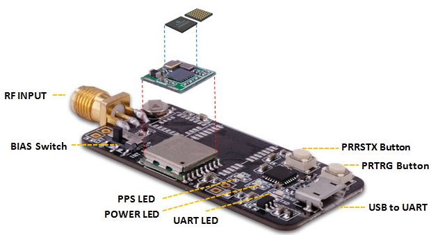
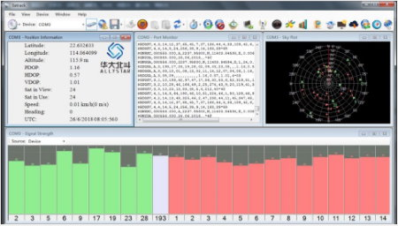
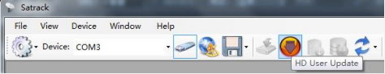
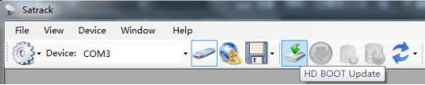

Multi-band RTK evaluation kit

 

### Specifications
* GPS/QZSS L1/L2/L5,GLONASS L1/L2
* BDS B1/B2/B3,GALILEO E1/E5A
* Raw measurement output
* RTKLIB-compatible
* Ready for QZSS L6D/E for PPP
* USB-UART interface
* Size: 48mm x 23mm
* Module on board support 12x16mm and 10x10mm

### Overview

 - output:NMEA-0183, RTCM3
 - raw data:RTCM3 format(MSM7)
 - default baud rate:115200 bps
 - rates up to 10hz

### Operate RTK with rtklib

[**Quick Guide**](rtk-test.md)
 
### How to buy it?

  Order no:
  
 | Item | specifications | Bluetooth | P/N |
 | :--- | :--- | :--- | :--- |
 | Standard RTK | GPS L1/L2,BDS B1/B2, GLO L1/L2 GAL E1 | N | ME-00-00 |
 | Bluetooth  RTK receiver | same as above | Y | ME-BT-01 |
 | with QZS L6D/E | GPS/QZS L1/L6,BDS B1/B3I, GLO L1OF,GAL E1/E6 | N | ME-00-02 |
 
 

 

 
 

### Antenna connector
An SMA female jack is available on the side panel of the evaluation unit for connecting an active
or passive antenna. The EVK provides the power supply for Antenna power. Use the BIAS switch to select the
power source. INT_BIAS with recommended maximum output current 20 mA is powered by the module, and
EXT_BIAS with recommended maximum output current 50 mA is powered by the LDO.

### Power status
The power LED indicates the power status. When the module is powered on, the LED is on.

### Startup with Satrack

 
[Satrack download](firmware/Satrack_client.zip)
 

1) Connect the EVK with the antenna and PC. See Section 3.

2) Launch the Satrack application.

3) Select the corresponding COM port.

4) Set the baud rate if necessary by choosing “Device settings” on strip toolbar. If the port is selected and
the baud rate is set correctly, Satrack program will show the received EVK output on the screen, signal
strength, as well as satellite constellation.

### Firmware updating

 
[Satrack download](firmware/Satrack_client.zip)
 

#### user mode
1) Connect to the EVK through COM ports.

2) Select “HD User Update” from the tool bar, and the file choosing dialog will be shown.

3) Find the file to send and press “Open” to start sending the file and finish firmware updating.

#### boot mode
1) Connect to the EVK through COM ports.

2) Use the PRRSTX and PRTRG buttons to set the module to enter Boot mode.

3) Disconnect the module first by clicking “DisConnect” from the tool bar and then reconnect the module
again by clicking “Connect” from the tool bar. The module will enter the Boot mode.

4) Select “HD BOOT Update” from the tool bar.

5) Find the file to send and press “Open”.

6) Press “Send” to start sending the file and click “Close” to close the updating window after firmware
updating finishes.

7) After firmware updating completed, press RESET button on the EVK to restart the module.

**DO NOT interrupt the file transfer, keep program running and make sure all cables are well connected when
the file is transmitting.** 

### Download the latest firmware 

  | Item | GNSS options | firmware |
  | ----- | :----- | :----- |
  | Option A | GPS L1/L5,GLO L1,BDS B1/B2a,GAL E1/E5A | / |
  | Option B | GPS L1/L2,GLO L1/L2,BDS B1/B2I,GAL E1/E5b | [HD9310B.8067](firmware/HD9310B.HDBD.GN3.115200.8067.0dcba.190813T1.cyfm) |
  | Option C | GPS/QZSS L1/L2/L6,GLO L1,BDS B1/B3I | [notes](firmware/L6/L6DE_tech_intro.pdf) |
