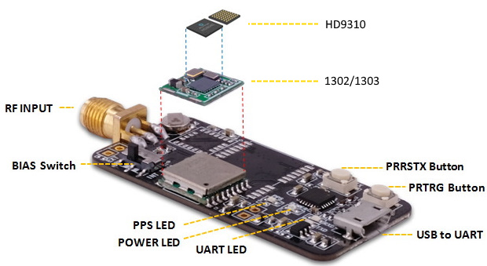

TAU1302/1303 Multi-band RTK EVK

 

 
TAU1302/1303 is a high performance multi-band GNSS positioning module, which is 
based on HD9310 chipset from Allystar.

TAU1302/1303 integrates efficient power management architecture, while providing 
high precision, high sensitivity and low power GNSS solutions which make it suitable
for professional industy market.

 

 

### 1.Overview

 
 

 

 - GPS/QZSS L1/L2/L5,GLONASS L1/L2
 - BDS B1/B2/B3,GALILEO E1/E5A
 - Raw measurement output
 - RTKLIB-compatible
 - Ready for QZSS L6D/E for PPP
 - USB-UART interface
 - Size: 48mm x 23mm
 - Weight:~6.2g
 - TAU1302/1303 on board
 - Precision agriculture, UAV mapping, deformation monitoring, surveying and mapping

 ***In most cases, the evk you purchased is with 1302 module.***
 
 
 
 Related Document:
 
 [TAU1302-1303-Datasheet.V1.0](files/T-5-1909-001-TAU1303-DS.V1.0.pdf)  
 [TAU1302-1302-Datasheet.V1.1](files/T-5-1910-002-TAU1302 Datasheet-V1.1.pdf)  
 [TAU130x GNSS Protocol Specification V2.3](files/T-5-1908-001-GNSS_Protocol_Specification-V2.3.pdf)  
 
 
 
 

### 2.Operate RTK with rtklib

[**Quick Guide**](rtk-test.md)

**Operate on an Android device(D301)**coming soon

 
 
 
### 3.Order 

  Order No.:
  
 | Item | specifications | Bluetooth | P/N |
 | :--- | :--- | :---: | :---: |
 | Standard RTK | GPS L1/L2,BDS B1/B2, GLO L1/L2 GAL E1 | N | ME-00-00 |
 | Bluetooth  RTK receiver | same as above Bluetooth connection RTK status LED | Y | ME-BT-01 |
 | with QZS L6D/E | GPS/QZS L1/L6,BDS B1/B3I, GLO L1OF,GAL E1/E6 | N | ME-00-02 |
 
 

 
 
  
 
 
 

### 4.Antenna 
An SMA female jack is available on the side panel of the evaluation unit for connecting an active antenna. The EVK provides the power supply for Antenna power. Use the BIAS switch to select the power source. INT_BIAS with recommended maximum output current 20 mA is powered by the module, and EXT_BIAS with recommended maximum output current 50 mA is powered by the LDO.

**To keep the high performance,this EVK requires antenna gain greater than 40db**

**It is best to use our recommended antenna**

<a href="https://www.datagnss.com/products/at400-multi-band-antenna-for-rtk" target="_blank">AT400 COST-EFFECTIVE MULTI-BAND ANTENNA FOR RTK</a>

 
 
 
 

### 5.Power status
The power LED indicates the power status. When the module is powered on, the LED is on.

 
 
 
 

### 6.Startup with Satrack

 
[Satrack download](firmware/Satrack_client.zip)
 

1) Connect the EVK with the antenna and PC. 

2) Launch the Satrack application.

3) Select the corresponding COM port.

4) Set the baud rate if necessary by choosing “Device settings” on strip toolbar. If the port is selected and the baud rate is set correctly, Satrack program will show the received EVK output on the screen, signal strength, as well as satellite constellation.

 
 
 
 

### 7.Firmware updating

 
[Satrack download](firmware/Satrack_client.zip)
 

Find out current version:

"View"-"HD Messages"

#### 7.1 user mode
1) Connect to the EVK through COM ports.

2) Select “HD User Update” from the tool bar, and the file choosing dialog will be shown.

3) Find the file to send and press “Open” to start sending the file and finish firmware updating.

#### 7.2 boot mode

***Boot mode is only used if the upgrade fails in user mode.***  

1) Connect to the EVK through COM ports.

2) Use the PRRSTX and PRTRG buttons to set the module to enter Boot mode.

3) Disconnect the module first by clicking “DisConnect” from the tool bar and then reconnect the module
again by clicking “Connect” from the tool bar. The module will enter the Boot mode.

4) Select “HD BOOT Update” from the tool bar.

5) Find the file to send and press “Open”.

6) Press “Send” to start sending the file and click “Close” to close the updating window after firmware
updating finishes.

7) After firmware updating completed, press RESET button on the EVK to restart the module.

**DO NOT interrupt the file transfer, keep program running and make sure all cables are well connected when
the file is transmitting.** 

 
 
 
 

### 8.Enable/Disable specific message output

Menu "View"--"Messages"

| ID | Class ID | MSG ID | ID | Class ID | MSG ID |
  | ----- | :----- | :----- | :----- |
  | GGA | F0 | 00 | RTCM1005 | F8 | 05 |
  | GLL | F0 | 01 | RTCM1019 | F8 | 13 |
  | GSA | F0 | 02 | RTCM1020 | F8 | 14 |
  | GRS | F0 | 03 | RTCM1077 | F8 | 4D |
  | GSV | F0 | 04 | RTCM1087 | F8 | 57 |
  | RMC | F0 | 05 | RTCM1097 | F8 | 61 |
  | VTG | F0 | 06 | RTCM1117 | F8 | 75 |
  | ZDA | F0 | 07 | RTCM1127 | F8 | 7F |
  
  if you want to disable RTCM1087, and enable RTCM1085, need two steps:
  1. set 1087 period to 0  
  2. then set 1085 period to 1.  
  
  For,RTCM1085,msg id is 85(dec), to hex is 55.  
  So RTCM1085,Class ID is F8, and msg id is 55.  
  
  
  
  **above picture is screenshot of Calculator**
  
  
   
 
 
 
  
### 9.Download the latest firmware[1] 

  | Item | GNSS options | firmware[2] |
  | ----- | :----- | :----- |
  | Option A | GPS L1/L5,GLO L1,BDS B1/B2a,GAL E1/E5A | HD9310A.8226 |
  | Option B | GPS L1/L2,GLO L1/L2,BDS B1/B2I,GAL E1 | [HD9310B.8367](firmware/HD9310B.HDBD.GN3.115200.8367.2546d.191218T2.cyfm)  |
  | Option C | GPS/QZSS L1/L2/L6,GLO L1/L2, BDS B1/B3I GAL E1/E6| / |  

  
**QZSS L6 include L6/D and L6/E, there is two version firmware support different data, 
please contact info@datagnss.com to get detail information.** 

*[1]If you need other version firmware, please contact <info@datagnss.com>*

*[2]This version is released on Dec.18.2019*
