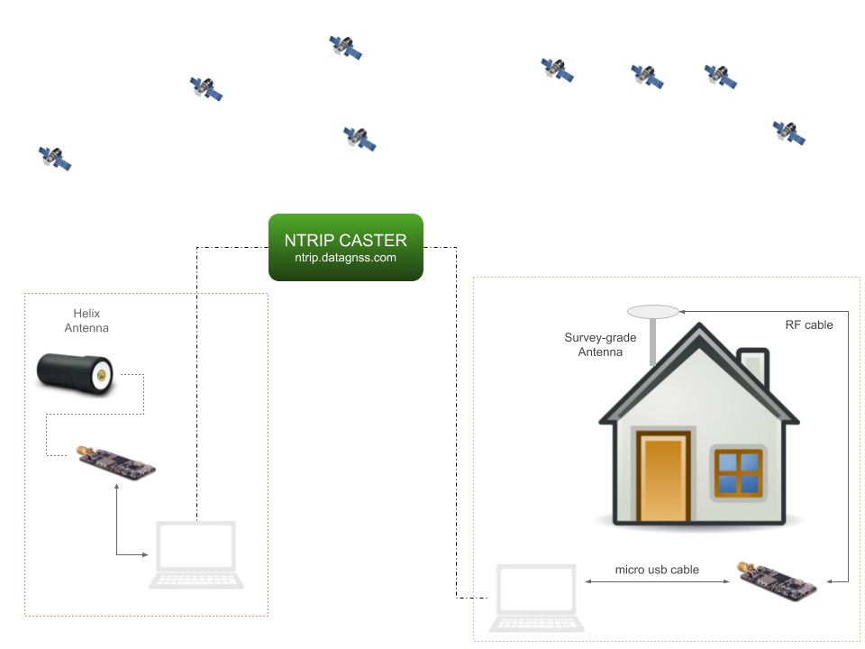
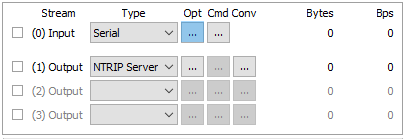
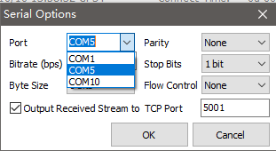
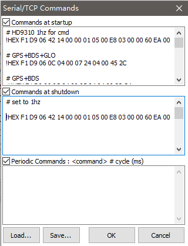
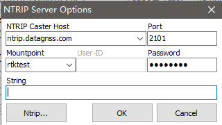
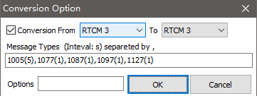
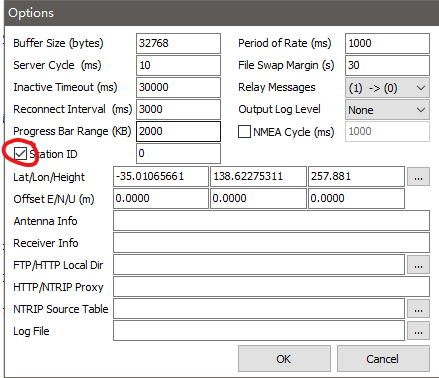
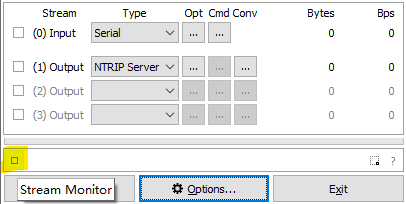
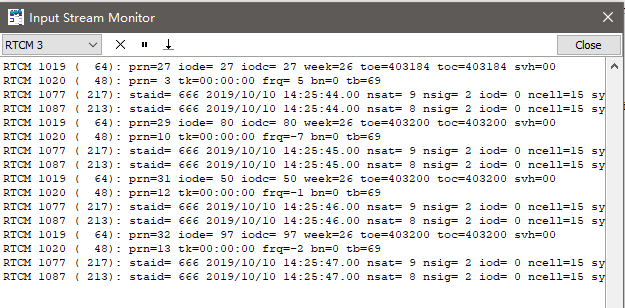

RTK evk field test with rtklib

 

### Requirement

#### Hardware
* rtk evk *2
* GNSS antenna*2
* micro USB cable*2
* RF cable*2

#### Software
Download the latest rtklib from [RTKLIB-2.4.3B33](https://github.com/tomojitakasu/RTKLIB_bin/tree/rtklib_2.4.3/bin)
(current version:2.4.3B33)

or [demo5 version](https://github.com/rtklibexplorer/RTKLIB) 

*This version has some special feature for low cost RTK receiver*

### Operations

#### Base station setup

1.Connect your rtk evk to Laptop via usb port.

 
2.The computer will install the usb driver automaticlly if this is the first connection. It will popup a tips tell you finish this setup about 1-3 minutes later.
if not, you could download the driver and install it by yourself.  [CP210x driver](files/CP210x_VCP_Windows.rar)

 
3.Find your com port number like Com3 in device manager or ignore this step.

 
4.run strsvr (a powerful stream utility of rtklib), then choose the input stream type to **"Serial"** , then click opt "...", find com port of the EVK.

Baud rate: **115200**

 
5.Then click the cmd button (right side of opts button) to load cmds file for EVK.

Please download command files:
[HD9310-5Hz-GGB.cmd](files/9310_5Hz_good.cmd)

 
6.Choose the output stream No 1 type to NTRIP server. Then input parameters like the following image:

You could input the mountpoint whatever you want, but the best is it is a special string for you.

Password: ******** (inqury it by sending email to info@datagnss.com )

 
7.Then click Conv button in this output stream:

check the checkbox of "Conversioning from..."

input Message type:
1005(5),1077(1),1087(1),1097(1),1127(1)

 
8.Then click the Options button in the main UI.

input your coordinate of base station, then check "Station ID".

 
9.Now,you could press start button to begin uploading base station's raw data to NTRIP caster.

you could check if the data is correct via the data monitor.

click the small button **"Stream Monitor"** to open data monitor window.

And also check the coordinate from RTCM1005 is the same one you input.

#### Rover setup

1.Run RTKNavi.

 
2.Config Input Stream 

**output raw data format:RTCM3**

**default baud rate:115200 bps**

 
press "Cmd" button, load cmd from the following cmd file:
 
[cmds for HD9310](../files/9310_5Hz_good.cmd)
 
 

config base station stream:

 
3.Config rtk processing options

 
4.Do rtk positioning.

