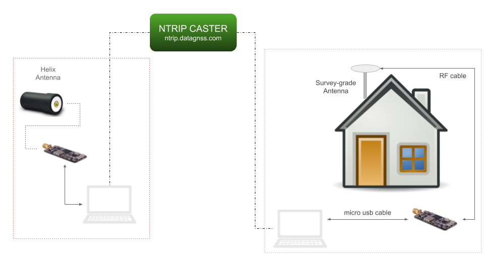

<span class="markdown-body-normal-header">RTK evk field test
</span>
<br>




### Requirement

#### Hardware
* RTK EVK *2
* GNSS antenna*2
* USB cable*2
* GNSS antenna cable

<br>

[How to choose GNSS antenna for your RTK application?](../../d303-docs/common/choice-of-antenna)

#### Software
Download the latest rtklib from [RTKLIB-2.4.3B33](https://github.com/tomojitakasu/RTKLIB_bin/tree/rtklib_2.4.3/bin)
(current version : 2.4.3B33)

or [demo5 version<sup>[1]</sup>](https://github.com/rtklibexplorer/RTKLIB) 

*<sup>[1]</sup>This version has some special feature for low cost RTK receiver*

**It is recommended to download the following optimized version for this evk.**  

**It is zero configuration for this evk(TAU130x series).**

[demo5 zero configuration version for DATAGNSS](files/rtknavi.zip)

### Operations

#### Base station setup

<br>

[Where to place your receiver in field?](../../d303-docs/common/about-rtk/#where-to-place-your-rtk-receiver)

<br>
1.Connect your RTK EVK to Laptop via usb port.

<br>
2.The computer will install the usb driver automaticlly if this is the first connection.  
It will popup a tips tell you finish this setup about 1-3 minutes later.  
if not, you could download the driver and install it by yourself.  
[CP210x driver](files/CP210x_VCP_Windows.rar)

<br>
3.Find your com port number like Com3 in device manager or ignore this step.

<br>
4.run strsvr (a powerful stream utility of rtklib), then choose the input stream type to **"Serial"** , then click opt "...", find com port of the EVK.


Baud rate: **115200**

<br>
5.Then click the cmd button (right side of opts button) to load cmds file for EVK.


Please download command files:
[HD9310-5Hz-GGB.cmd](files/9310_5Hz_good.cmd)

```
# HD9310 1hz for cmd
!HEX F1 D9 06 42 14 00 00 01 05 00 E8 03 00 00 60 EA 00 00 D0 07 00 00 C8 00 00 00 36 AF

# GPS+GLO+BDS+GAL
!HEX F1 D9 06 0C 04 00 17 24 04 00 55 6C

# GPS+GLO
#!HEX F1 D9 06 0C 04 00 13 24 00 00 4D 54

!WAIT 100

#enable BD-GEO
!HEX F1 D9 06 16 0C 00 01 01 02 01 03 01 04 01 05 01 11 00 4D FB

#disable some extra msg list
#disable RTCM1005
!HEX F1 D9 06 01 03 00 F8 05 00 07 31
#disable GGA
!HEX F1 D9 06 01 03 00 F0 00 00 FA 0F
#disable GSA
!HEX F1 D9 06 01 03 00 F0 02 00 FC 13
#disable GSV
!HEX F1 D9 06 01 03 00 F0 04 00 FE 17 
#disable ZDA
!HEX F1 D9 06 01 03 00 F0 07 00 01 1D 
#disable RMC
!HEX F1 D9 06 01 03 00 F0 05 00 FF 19 

#track elev mask 15 navigation mask 5
!HEX F1 D9 06 0B 08 00 92 0A 86 3E C2 B8 B2 3D E2 12

!WAIT 100
#set output rate to HD9310 5hz
!HEX F1 D9 06 42 14 00 00 05 05 00 C8 00 00 00 60 EA 00 00 D0 07 00 00 C8 00 00 00 17 CE

```

<br>
6.Choose the output stream No 1 type to NTRIP server. Then input parameters like the following image:


You could input the mountpoint whatever you want, but the best is it is a special string for you.

Password: ******** (inqury it by sending email to info@datagnss.com )

<br>
7.Then click Conv button in this output stream:

check the checkbox of "Conversioning from..."


input Message type:
1005(5),1077(1),1087(1),1097(1),1127(1)

<br>
8.Then click the Options button in the main UI.


input your coordinate of base station, then check "Station ID".

<br>
9.Now,you could press start button to begin uploading base station's raw data to NTRIP caster.

you could check if the data is correct via the data monitor.

click the small button **"Stream Monitor"** to open data monitor window.


And also check the coordinate from RTCM1005 is the same one you input.


#### Rover setup

1.Run RTKNavi.

<br>


2.Config Input Stream 

**output raw data format:RTCM3**

**default baud rate:115200 bps**

<div style="text-align: left;">

</div>

<div style="text-align: left;">

</div>

<br>
press "Cmd" button, load cmd from the following cmd file:
<br>
[cmds for HD9310](../files/9310_5Hz_good.cmd)
<br>
<br>

config base station stream:

<div style="text-align: left;">

</div>


<br>
3.Config rtk processing options

if you use zero configuration version, please skip this step.

<div style="text-align: left;">

</div>

<div style="text-align: left;">

</div>

<br>
4.Do rtk positioning.
<div style="text-align: left;">

</div>

<div style="text-align: left;">

</div>

